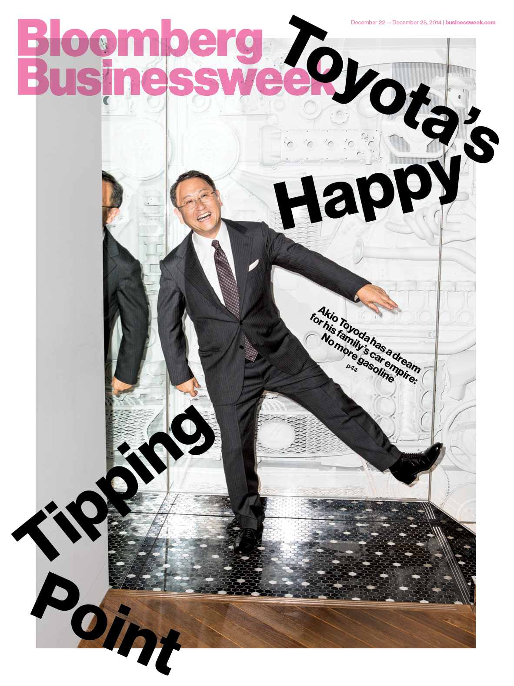

<!-- SMAG displays recent posts   -->

	

		

			
			<h4>First award title here</h4>
			 
			
			
			
	
			<h4>Second award title there</h4>
			
Toyota and 12 other members of the hydrogen council are betting $10.7 billion on hydrogen. In 2016, Toyota formalized its relationship with HydrogeNXT and signed a letter of support which recognizes how Toyota and HydrogeNXT can help each other get to a world beyond gasoline.

			
From the article: "Toyota Motor Corp. and four of its biggest car-making peers are joining oil and gas giants including Royal Dutch Shell Plc and Total SA with plans to invest a combined 10 billion euros ($10.7 billion) in hydrogen-related products within five years."

			
<i class="fa fa-newspaper-o"></i> <a href="https://www.bloomberg.com/news/articles/2017-01-17/toyota-shell-among-auto-and-oil-giants-forming-hydrogen-council">Read full article here</a> in Bloomberg.

			
			

			

				
			
					<h4>Want to learn more?</h4>
					<a href="{{ "/index.html#contact" | relative_url }}" class="btn btn-xl">Get in touch</a>

				

	

	
 <!-- TODO: put this into stylesheet properly -->
		<ul class="list-inline social-buttons">
			<li><a href="#"><i class="fa fa-twitter"></i></a>
			</li>
			<li><a href="#"><i class="fa fa-facebook"></i></a>
			</li>
			<li><a href="#"><i class="fa fa-linkedin"></i></a>
			</li>
		</ul>
	

	

